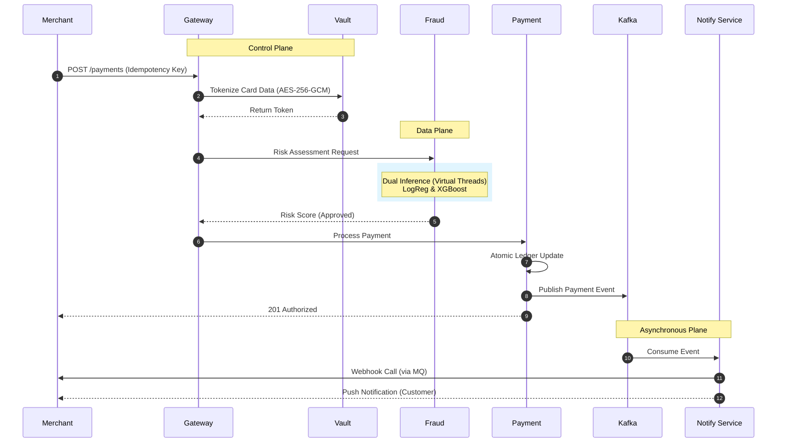

Markdown
# Distributed Payment Gateway

[](https://openjdk.org/projects/jdk/21/)
[](https://spring.io/projects/spring-boot)
[](https://kafka.apache.org/)
[](https://www.rabbitmq.com/)
[](https://www.postgresql.org/)
[](https://redis.io/)
[](https://xgboost.readthedocs.io/)
[](https://opensource.org/licenses/Apache-2.0)


[](https://opentelemetry.io/)
[](https://grafana.com/)
[](https://prometheus.io/)

A highly scalable, fault-tolerant, event-driven **Distributed Payment Gateway** built using Java 21 and Spring Boot. Designed to handle high-throughput financial transactions with low latency, strict data consistency via the **Saga Pattern**, and real-time fraud detection using machine learning (**XGBoost**).

---

## Architecture & System Design

The system follows a microservices architecture communicating via both synchronous REST APIs and asynchronous event-driven messaging pipelines (Apache Kafka & RabbitMQ).

[//]: # (                     +------------------------+)

[//]: # (                     |      API Gateway       |)

[//]: # (                     +-----------+------------+)

[//]: # (                                 |)

[//]: # (       +-------------------------+-------------------------+)

[//]: # (       |                                                   |)

[//]: # (       v                                                   v)

[//]: # (+---------------------+                             +---------------------+)

[//]: # (|  Payment Service    |                             | Transaction Service |)

[//]: # (| &#40;Saga Orchestrator&#41; |                             |  &#40;Read/CQRS Model&#41;  |)

[//]: # (+----------+----------+                             +---------------------+)

[//]: # (|)

[//]: # (+------------+--------------------+--------------------+)

[//]: # (|            |                    |                    |)

[//]: # (v            v                    v                    v)

[//]: # (+-----------+ +-----------+      +------------+      +---------------+)

[//]: # (|  Ledger   | |  Wallet   |      |   Fraud    |      | Notification  |)

[//]: # (|  Service  | |  Service  |      | Detection  |      |   Service     |)

[//]: # (+-----------+ +-----------+      |  &#40;XGBoost&#41; |      +---------------+)

[//]: # (+------------+)

[//]: # (|            |                    |                    |)

[//]: # (+------------+--------------------+--------------------+)

[//]: # (|)

[//]: # (v)

[//]: # (+---------------------------+)

[//]: # (| Kafka / RabbitMQ Event Bus|)

[//]: # (+---------------------------+)

[//]: # (|)

[//]: # (+-----------+-----------+)

[//]: # (|                       |)

[//]: # (v                       v)

[//]: # ([ PostgreSQL ]          [ PostgreSQL ])




### Microservices Breakdown
| Service Name | Port | Description | Primary Datastore |
| :--- | :--- | :--- | :--- |
| **API Gateway** | `8080` | Entry point, rate limiting, JWT authentication, and request routing. | Redis |
| **Auth Service** | `8081` | Core transaction workflow engine implementing the **Saga Orchestrator pattern**. | PostgreSQL |
| **Payment Service** | `8082` | Double-entry bookkeeping system ensuring financial record integrity. | PostgreSQL |
| **Merchant Service** | `8083` | User login, user creation and management. | PostgreSQL |
| **Vault Service** | `8084` | User balance management, ledger accounting, and multi-currency support. | PostgreSQL |
| **Notification Service**| `8085` | Async event consumer dispatching Webhooks, SMS, and Email notifications. | MongoDB / Redis |
| **Fraud Service** | `8086` |  Real-time risk scoring engine embedding an **XGBoost** classification model.  | PostgreSQL |

---

## Tech Stack & Key Technologies

* **Language:** Java 21 (Virtual Threads / Project Loom considerations, Pattern Matching)
* **Framework:** Spring Boot 3.2+, Spring Cloud (Gateway, Eureka), Spring Data JPA
* **Event Streaming & Messaging:** Apache Kafka (High-throughput event logs), RabbitMQ (RPC & transactional queues)
* **Databases:** PostgreSQL (Per-service database isolation pattern)
* **Caching & Rate Limiting:** Redis
* **Machine Learning:** XGBoost (Python inference microservice / ONNX Runtime integration)
* **Resilience & Fault Tolerance:** Resilience4j (Circuit Breakers, Bulkheads, Rate Limiters)
* **Containerization & Orchestration:** Docker, Docker Compose, Kubernetes (Helm Charts)
* **Observability:** Prometheus, Grafana, OpenTelemetry, Zipkin (Distributed Tracing)

[//]: # (---)

[//]: # (## Distributed Transactions: The Saga Pattern)

[//]: # ()
[//]: # (To maintain consistency across independent microservices without distributed locks &#40;avoiding 2PC bottlenecks&#41;, the system implements the **Orchestration-based Saga Pattern**.)

[//]: # ()
[//]: # (### Example: Payment Processing Workflow)

[//]: # (1. **Initiate:** Client calls `/api/v1/payments`, generating a `PaymentInitiatedEvent` sent to Kafka.)

[//]: # (2. **Fraud Check:** Payment Orchestrator calls Fraud Service &#40;`XGBoost`&#41;. If risk score > threshold, transaction is aborted.)

[//]: # (3. **Reserve Funds:** Orchestrator sends command to Wallet Service to lock funds.)

[//]: # (4. **Ledger Entry:** Orchestrator requests Ledger Service to record a pending transaction.)

[//]: # (5. **Gateway Settlement:** External acquirer integration &#40;Stripe/PayPal mock&#41;.)

[//]: # (6. **Compensation &#40;Rollback&#41;:** If any step fails &#40;e.g., gateway timeout or insufficient funds&#41;, the orchestrator triggers compensating transactions in reverse order &#40;e.g., release wallet locks, record failure ledger&#41;.)

[//]: # ()
[//]: # (---)

[//]: # ()
[//]: # (## Machine Learning Fraud Detection &#40;XGBoost&#41;)

[//]: # ()
[//]: # (The Fraud Detection Service evaluates every transaction within `< 15ms` using features such as:)

[//]: # (* Velocity checks &#40;number of transactions in last 5m/1h&#41;)

[//]: # (* Geolocation discrepancy scoring)

[//]: # (* Amount deviation from user historical average)

[//]: # (* Device fingerprinting risk analysis)

[//]: # ()
[//]: # (Trained on synthetic financial transaction datasets using Python &#40;`xgboost`, `scikit-learn`&#41;, and served via an optimized high-performance inference pipeline.)

---

## Getting Started & Installation

### Prerequisites
* **Java 21 JDK** 
* **Maven 3.9+**
* **Docker**

### 1. Clone the Repository
```bash
git clone ...
cd distributed-payment-gateway
```
### 2. Build, Run Microservices and Infrastructure using docker-compose.

```bash
docker compose up --build -d
```

[//]: # (&#40;Kafka, RabbitMQ, PostgreSQL, Redis, OpenTelemetry, Grafana, Prometheus&#41; via Docker Compose)

[//]: # (```Bash)

[//]: # (docker-compose up -d)

[//]: # (```)
### 3. Build and Run Microservices using Maven / Spring Boot.
You can run services individually via Maven or use the root compose profile:


* Build all services
```Bash
mvn clean install -DskipTests
```

* Run API Gateway and Payment Service

```Bash
# cd distributed-payment-gateway
mvn spring-boot:run
```

### 4. Running Tests

* Unit Tests:
```Bash
mvn test
```
* Integration Tests (Testcontainers):

(Spins up ephemeral PostgreSQL and Kafka containers for end-to-end integration testing).
```Bash
mvn verify
```

### 5. API Documentation

- Once the services are running, explore the API endpoints via Swagger UI:

- API Gateway Swagger: http://localhost:8080/swagger-ui.html

[//]: # ()
[//]: # (## Payment Service Endpoints:)

[//]: # ()
[//]: # (* POST /api/v1/payments - Process a new payment transaction)

[//]: # ()
[//]: # (* GET /api/v1/payments/{transactionId} - Retrieve payment status)

[//]: # ()
[//]: # (## Sample Request &#40;POST /api/v1/payments&#41;)

[//]: # ()
[//]: # (JSON)

[//]: # (```)

[//]: # ({)

[//]: # (  "sourceUserId": "usr_99281a",)

[//]: # (  "destinationMerchantId": "mer_44829b",)

[//]: # (  "amount": 150.00,)

[//]: # (  "currency": "USD",)

[//]: # (  "paymentMethod": "CREDIT_CARD",)

[//]: # (  "cardToken": "tok_visa_debit")

[//]: # (})

[//]: # (```)

[//]: # (## Observability & Monitoring)

[//]: # (* Grafana Dashboards: http://localhost:3000 &#40;Pre-configured metrics for JVM heap, Kafka consumer lag, HTTP request latency percentiles p99/p95&#41;.)

[//]: # ()
[//]: # ([//]: # &#40;* Zipkin Tracing: http://localhost:9411 &#40;Trace distributed request flows across all 7 microservices&#41;.&#41;)


### License

Distributed under the Apache 2.0 License. See LICENSE for more information.
